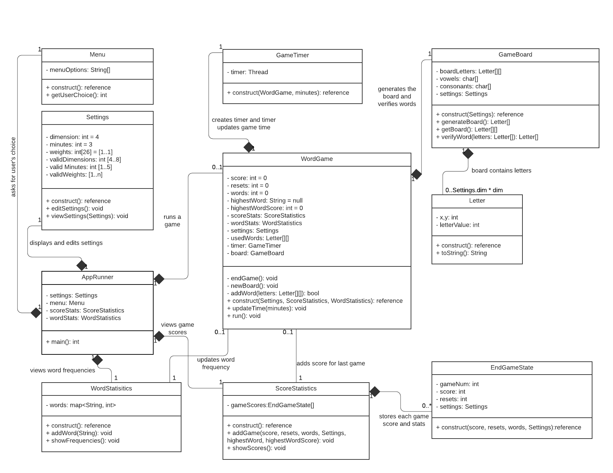

## Assignment #6 : Group Project 
### Design 1

##### Questions
* Do the Settings and Menu classes encompass GUI-oriented attributes or do they generate GUI elements with classes not shown here?
   * The design was (deliberately) vague on GUI elements. Based on postings in Piazza I think we can ignore the design implemtation of GUI for del #1. e.g. see post @728
* Is it necessary to maintain WordStatistics and ScoreStatistics objects throughout the lifetime of the game or could they be generated at the end? (might be pros or cons to either approach).
   * The design decided to instance them early so they could collect stats as the game(s) progress. e.g. my understandng is that word frequencies have to track frequency across all games that a single instance of GameRunner runs. However once GameRunner exits to the OS the stats are not persisted. 
* Would a type of abstract `Runner` class that settings, game, and stats inherit make sense? Something that includes a render function that could be triggered by a factory / `getUserChoice`.
* How does the timer work? I like the idea of a `thread` but I'm not sure if the `WordGame` instance should be in charge of updating it. 
   * Actually the timer updates the WordGame, not the other way around. Every second the timer calls WordGame.updateTime() on a new thread. So no matter what WordGame is doing - eg. waiting for input, verifying a word or displaying the board that 2nd thread will update the game time at exaclty one second intervals. The idea was that if WordGame has a GUI element for time then updateTime() could update it. If timing is not on a thread independent of the the GUI update thread, timing wont be shown correctly - e.g. it may block waiting for user input.
##### Pros
* I liked the indication of "default" values within the diagram itself using the "=". Very succinct and easy to understand.
* I liked the inclusion of a "GameRunner" or similar class whose responsibility it is to manage the creation/deployment of a game. This seems like a nice separation between the "state" of the WordGame vs. the "control" offered by the GameRunner.
* The GameTimer class seems like a good idea here as it provides for an asynchronous thread capable of "popping" a timer that is separate from other threads of execution. This seems like a clean approach with calls back into WordGame.updateTime().
Good job spelling out some of the algorithm specifics. This should help us on our way to implementation.
* I liked the indication of private and public member fields (+/-) to disambiguate them.
* I like the detail and that you included a lot of descriptions on the relationships, with verbs describing what exact the relationships do.
* Separate thread for the timer is a good idea
* I like the idea of having game states - maybe we could expand this to include `StartGameState` and something like `GamePlayState`
##### Cons
* Curious whether we could capture the rules governing letter generation using a "factory pattern" and contain the login within that class.
* I wonder if we even need a getUserChoice method or if this can be handled in the UI with separate methods for starting up the chosen action (game, statistics, settings)
* We will need a place to store the valid settings; we should be able to just throw these into the `Settings` class.
   * Yes, in the design Settings attributes hold the most recent Settings values the user created. The initial values are set when Settings is constructed. There is only ever 1 instance of Settings. That Settings instance is copied when updating and EndGameState. This is done so that when viewing stats for any game played, the settings that were in use at that time can also be shown.
* I think we will want an additional function for setting the weights since its a bit more involved than just validation and setting.
   * Editing the 26 weights should be pretty straightforward. Generating the board letters according to the weights, not as straightforward. But an algorithm was suggested in design-discusion that should work fine and guarantee that the ratio of vowels vs. consonants is correct.
##### Notes
* A recognition of mouse and/or touch movements and responding to these events seems like a good thing to keep in mind at the design outset with a "listener" model. The notion of "sliding" letter tiles across a board canvas and tying in verification algorithms (for adjacency, etc.) at time of need seems like a good approach. 
   * Agreed - maybe similar to https://www.wordplays.com/boggle 

### Design 2

##### Questions
* Does the allGameStatistics field of the GameStatistic class represent an array of GameInstances? I'm wondering if there may need to be higher coupling for a user to be able to view, for example, the game settings applied to a past game.
    * I should have made this more clear - the idea was that this could store the things like number of resets and total score for each game that was played. Ideally it would be another type of statistic class and `GameStatistic` would include an array of them.
##### Pros
* The logic flow seems clear and straight forward.
* Having both types of statistics inherit from a common base class (Statistic) is a good idea. e.g. for pagination support as illustrated.
* Having a separate class for each Tile is a good idea. Possibly that class can handle the 'Qu' rule and avoid having to have that logic ('u' always to follow 'Q') needing to be known by more classes.
* Keeping the design of the UI implementation out of the high-level design seems like a good idea so we can get a simpler picture of the 'model' of the application.
* The BagOfTiles initialization step to generate a weighted sampling of tiles seems like a good approach to "generating" tiles for a board, given arbitrary user input.
* This design maintains a low coupling degree between components, which seems like a good idea.
* I like how the Statistics Model is broken up into many smaller parts which looks like will make it easier to manage.
* I think having settings split up and allowing us to update one setting at a time instead of requiring all of them is great, although that might be something we can handle within the method instead.
##### Cons
* A timer that is not checked in an independent thread can allow the user to be still entering a word after the timer expires. However (and correctly) the design described does not give the player points in this case.
    * Agreed - I like the thread idea presented in some of the other diagrams. 
* The narrative makes the multiplicity between classes clear but it would be nice to be able to see that on the class diagram as an extra aid to understanding.
* Having the attribute types and method return values defined would make things more clear but overall, the design is made very easy to follow
##### Notes
* I think that having the player entering the word via a text edit in GameInstance.enterWord() requires a more complex validation than a UI where the player indicates the letter's position on the board. That's not to say we should not allow entering a word by both a) entering it on a text field and b) mouse clicks/drags.
The issue comes up when there are for example >1 'a' on the board. Using a mouse, the verification algorithm knows the character position and therefore knows all the adjacencies. However if the 'a' is entered in a text field the algorithm needs to be able to check all 'a''s on the board for adjancies becuase its not clear which 'a' the user intended to use. i.e. when letters may exist more than once on the board, the algorithm needs to examine all possible paths through the board to be sure it has not missed a valid path that verifies the player's input word.
    * I was initially thinking of what you suggested but I read the requirements as entering a word rather than selecting on. If clicking works then I'm all for that.

### Design 3

##### Questions
* Do we need a user object and permanent storage in a DB or is it above and beyond requirements?
* If the app blocks for a long time waiting for user input can the game timeout during that 'wait for input' state or is timeout only checked before each user input?
* Does the design design classes based on an MVC approach? e.g. Are there some classes that are just 'model' classes and some that are 'view' classes?
* Do we need the WordCount class? Or could we use some sort of Map?

##### Pros
* As in this class diagram, lets adopt the standard that all attributes have getters and setters but we dont have to show those as separate operations.
* The class diagram comments are nice to have. Lets do similar in the final class diagram.
* Multiplicities on associations are good to have (but were never shown in lecture). Lets do similar in the final class diagram.
* Good idea to have GameSettings handle all aspects of enumerating characters and their weights
* If a letter occurs > 1 on the board the verification algorithm needs to know which instance of the letter the user selects since that affects adjacencies. (or the verification needs a more complex algorithm to check all possible locations of a letter). The Letter object has the x,y of the location to correctly disambiguate letters. This also means that a mouse based GUI for entering letters (in words) is recommended (vs. via a text field) in the final app since verification can know each letter's board position.
* I like the GameStatistics class, makes it very clear what information is there and is simple enough without too many sublcasses.
* Very clear to see which functions involve which relationships - is there some way to more easily distinguish where a function call lives? It took me a second to see that `viewGameLogs` is on the `GameStatistics` object rather then GUIUser. I don't think this is a big deal and I like the clarity overall but it did take me a second.
##### Cons
* None come to mind - the design looks like it would work well but maybe could have a reduced class count if we decide not to implement a 'user' concept.
* Agree that a user class may not be needed, but definitely something to think about because it obviously has benefits
    * We may not need a user class but I think an entry point set up like `GUIUser` makes sense.
* Would it make sense to have settings, stats, and game set up in a similar fashion? Rather than calling `startGame` or accessing the `settings` instance?
* I was under the impression that Q is always Qu but counts as 2 points. If that is the case we will need to add a way to store point value in the `Letter` class (even if its just checking for `Qu`)
* I think we'd want an instance variable for the character/string in the `Letter` class

### Design 4

##### Questions
##### Pros
* The use of a Timer class here separate from the main game logic that is able to trigger events from a separate thread is a positive here so that player interaction does not interfere with game time limit constraints. This Timer updating the Game's minutes_remaining (so that it can then be rendered in the view) seems like a good approach.
* Succinct - does not use a lot of classes/inheritance/coupling to realize the low-level design.
* The on_reroll() and on_complete() methods infer an event-driven, "listener" design that reacts to timer and user events, which is likely the approach we want.
* Good use of multiplicity indicators for relationships. We will likely want to use this in the final design.
##### Cons
* Could use a higher fidelity/level of detail in the diagram itself to indicate game logic flow.
* We will need a way to pass settings into the `Board` instances
* Since there are limited valid settings options we will need to store those somewhere. I think `GameSettings` would be fine
* The settings will also need to be passed back to the `Statistics` class so users can sort by board/mins/etc
* I think we'd want a class a level up from `Game` that users can start a game from and/or view the settings/stats that way a `Game` is solely responsible for game mechanics.

## Team Design
### UML Class Diagram

### Design Commonalities and Differences

For our team design, we chose to start with David's Design #1 as a basis since it seemed to most closely represent to spirit of our shared designs. Some of the highlights from our team discussion and evolution of the design:
* Each of our individual designs featured notion of a "game", "game settings", a "game board", and "statistics" classes.
* We differed in our individual designs in how granularly we represented the idea of "Letters" and "Words", and how the rules of the game enforced through validation steps. For example, Design #2 and #3 featured classes for "words" and "tiles"/"letters".
* We decided during our team meeting to add a "Letter" class as a concept to the team design for ease of use, flexibility, and the need to expose "location" information for the letter.
* Deviating from Design #1 and based on our shared understanding of the design language, we made some adjustments to multiplicities between components, connection type, and class naming.
* We agreed that our team design should feature an "AppRunner" class responsible for driving a game and setting up initial UI elements, such as the Menu. The original "GameRunner" class was adapted for this role since it is application wide rather than strictly game related. We also agreed to include a "GameTimer" class responsible for updating game time in a separate thread, something not featured in all individual designs.
* Some enhancements were made to the team design to add additional fields and combine functions that could perform the same operation. For example, verifyWordByCharacter() and verifyWordByPosition() in the "GameBoard" class were collapsed to verifyWord(). We swapped over to representing "words" and the board's layout of letters itself as multi-dimensional "Letter" arrays instead of char arrays. We endeavored to limit where the "Letter" class was exposed and used to WordGame and GameBoard only and represent "words" elsewhere as Strings.
* Some additional "plumbing" was put in to represent the user's path for adding a word through a UI element to the WordGame and onwards to the GameBoard's verifyWord() method. 
* Groups of settings (for both timer and game board size) were added in order to provide the settings class with valid options.
* As team members expressed in assignment #5, we don't need a detailed GUI design for the app at this stage of high level design. So we tried to limit any GUI-specific items from the classes for now, leaving the decision for who owns UI elements for later.
* One open question was whether we will we be building something that users click/touch or type? Click feels like a better UX (and easier to validate). We have decided to start with a click-based approach but we're keeping in mind both UI entry paths as eventual needs for this application.

## Summary

There are reasons to be optimistic going forward with our team's process and cohesion, as we quickly meshed and collaborated on this initial deliverable. Some of the highlights include:
* We quickly established a medium of communication with a Slack private channel through Georgia Tech that enabled asynchronous communication between team members and "threaded" discussion.
* We looked ahead and created a Trello instance to be used down the road as we design, develop, and test code deliverables.
* We made significant progress in forming this deliverable piece by piece using team member-specific git pushes and commentary through Slack.
* We established a discrete meeting time and used Zoom to conduct a live meeting where we collaborated on developing a shared LucidChart UML diagram and discussing design and implementation ideas.

Some **lesson's learned** through the process:
* It is important to get feedback and opinions from each team member regarding major design decisions so that we are all on the same page.
* It was helpful for each team member to describe their interpretation of a problem and class relationship "flow" so that misunderstandings could be ironed out.
* During collaboration, it was helpful to have a single team member "drive" a shared-screen video conference. If we use "live" update applications (LucidChart, etc.) then each team member can edit in context. This can help with speed and efficiency.
* It was important for us to come to shared understanding of what the design language (UML) meant in the context of the team design we produced, so that we are each speaking the same language.
* Asynchronous collaboration tools such as Slack are invaluable for team productivity.
* Much of this design process centered on internal game logic. There was some concern over when, where, and how GUI elements would be invoked. We may need a nice way of integrating this "layer" within the diagram or otherwise representing it going forward.