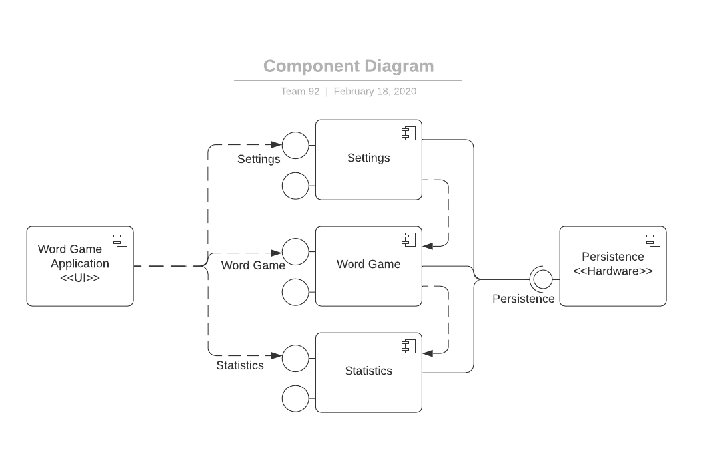
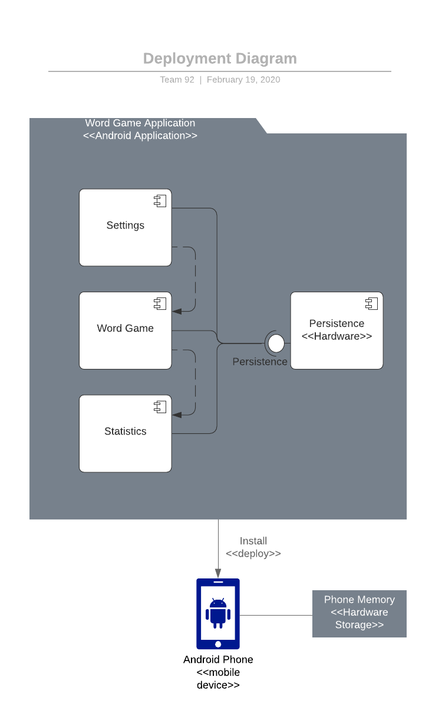
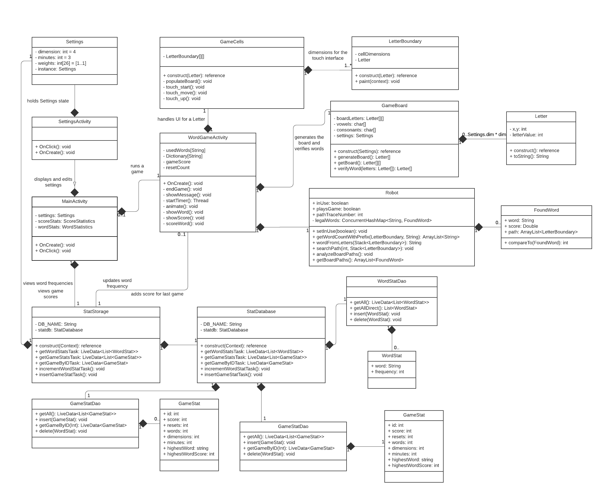
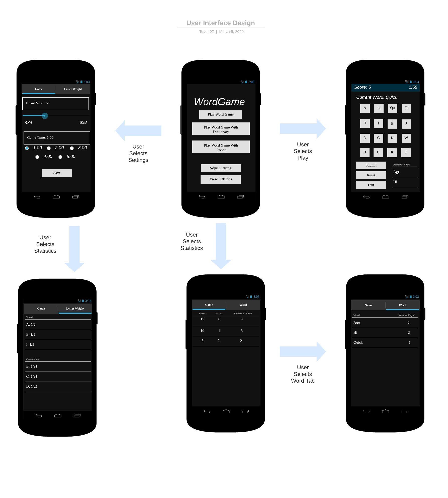

# Design Document

**Author**: Sam Buck

**Version**: 2.0
* Added information related to "dictionary mode" and "robot mode".
* Added mention of game settings persistence.
* Updated design documents to reflect current state of the application.

**Version**: 1.0

## 1 Design Considerations
### 1.1 Assumptions
* We expect the user to understand the rules of the game. Although they may be able to reference the documentation, the application itself will not contain learning materials or tutorials.
* When a user is playing the game in the normal "Play Word Game" mode, we assume that the user is only entering in valid words.
  * When a user is playing the game in the "Word Game With Dictionary" mode, entered words will be validated by the system.
* This application is only being designed for the English alphabet; users will not be able to select the language that is used.

### 1.2 Constraints
* The application is based on a user manually dragging over tiles. This requires the user's phone to be touch based.
* The board size settings cannot be customized past the provided options. This will allow us to ensure that the grid is squared properly rendered for all available sizes.
* Similar to board size, the range of allowed time is not customizable. Users must select a value within the provided range.
* The number of digits in the denominator of the weightings for each letter is limited from 1 to 3. Users will not be able to decrease the weights such that the probability for a particular letter is less than 1/100.
  * When the user selects the "Word Game with Dictionary" mode, letter weightings are automatically calculated based on their frequencies in stored validation dictionary.

### 1.3 System Environment
* This application is only expected to run on Android devices. It is not expected to run in a browser or on another type of mobile operating system i.e. iOS.
* The minimum version of Android that this will run on is 6.0 (Marshmallow). Compatibility with earlier versions is not expected.
* The application is being designed with smartphones in mind. Although it may function on larger devices, we are not designing the user interface for them. As such, the UI may become distorted on large devices.

## 2 Architectural Design

### 2.1 Component Diagram

* Word Game Application \<<UI\>>
* Settings
  * The settings component allows users to set the size of the board, how long each game is, and the distribution of letters that are provided.
    * The saved letter weights are ignored while playing in dictionary mode.
  * These settings are pulled in when a new game is started.
* Word Game
  * The game component is what the user interacts with after they start a game.
  * The word game can be played in normal, dictionary, or robot mode.
  * This will track statistics like words played, score, and number of resets.
  * It will need to pull the current settings from the settings module and send the results of each game to the statistics component.
* Statistics
  * The statistics component will allow users to view and interact with the outcome of previous games.
  * This component is made up of word and game statistics. The word statistics will be in charge of tracking and displaying the frequency of played words. Game statistics will show the outcome of previously played games in the form of score, number of resets, and number of words played.
* Persistence
  * This persistence is only stored on the phone itself while the application is open.
  * This data will not be pushed to another location.
  * The current settings and history of games played will be stored here.
  * This allows us to use different settings within the game and display game and word based statistics.

### 2.2 Deployment Diagram

* A *release* build will be compiled via Android Studio.
* Users then need to download the compiled APK onto their device(s).
* After downloading, users must click on the APK in order to trigger the installation process.
* Once this is completed, users will be able to access the application by selecting it in their application view.

## 3 Low-Level Design
### 3.1 Class Diagram

* Menu
  * The Menu class is what the user first interacts with when loading the application.
  * Three menu options are provided here: settings, game, and statistics.
* AppRunner
  * The `AppRunner` is the backbone of the application.
  * When a user selects a menu option, the `AppRunner` is in charge of calling the appropriate class. Because of this, the `AppRunner` has references to the settings, game, and statistic classes.
* WordStatistics
  * This class allows users to view the results of previous games played.
  * In particular, this handles serving the frequencies of each played words across all games.
  * When a game is completed, this class is called to update the frequency of each word that was played in that game.
* ScoreStatistics
  * This class also allows users to view previous results.
  * Unlike `WordStatistics`, this handles the logic behind displaying the results from individual games.
  * A collection of `EndGameState` objects is used in order to provide the score, number of board resets, and number of words from each game.
* EndGameState
  * The `EndGameState` stores a summary of a game that has been completed.
  * This includes an identifier, the final score, the number of times the board was reset, and which settings were used for that game.
* WordGame
  * `WordGame` provides the logic for playing the game.
  * Game statistics are stored in this object and updated as the user performs actions such as entering a word or resetting the board.
  * A `GameTimer` is referenced here in order to ensure that the user can only play for a certain amount of time.
  * This class will also update both statistic classes when a game is finished.
* Robot
  * `Robot` is an automatic game runner.
  * It will pick the available words and show them to the user.
  * It will attempt to find the highest scoring words that are possible.
* FoundWord
  * `FoundWord` stores the words that were found by the robot player.
  * This tracks the word, the score of that word, and the sequence or path of letters that create it.
* GameTimer
  * The timer is kept in a separate thread from the rest of the application. This is done to ensure that it is continuously updated even if the user is not performing any actions.
* GameBoard
  * The `GameBoard` handles interactions with the letter grid.
  * This includes resetting which letters are displayed and validating words as their letters are selected.
* Letter
  * A `Letter` is a specific tile on the `GameBoard`.
  * The letter's location is stored with the object and determines where on the board it lies.
  * It also contains an attribute which represents the value for that letter and a `toString` method.
    * This was necesarry because of the *Qu* edge case.
    * When *Q* is generated, it must be followed by a *u* and 2 (instead of 1) points are awarded for its use. 

## 4 User Interface Design

