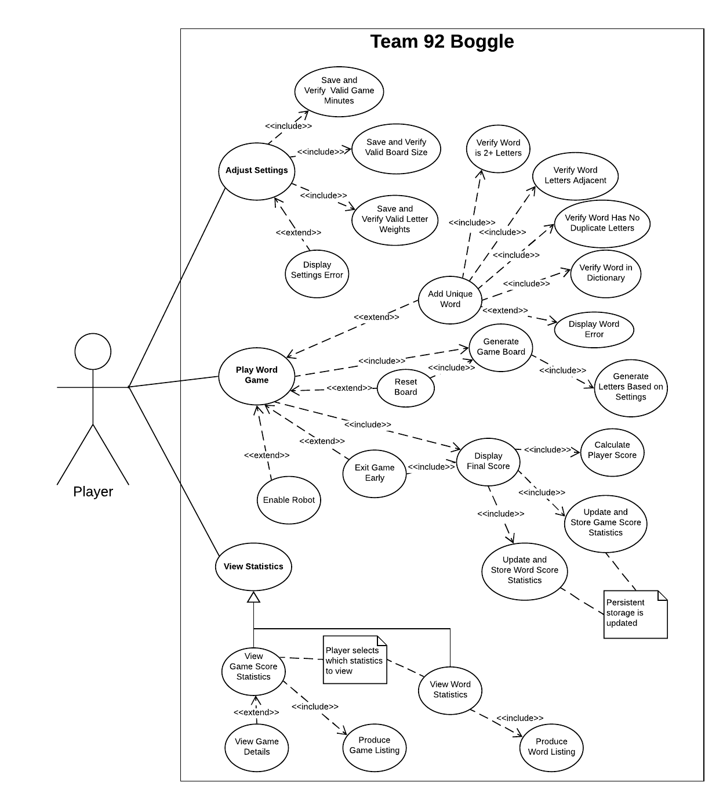

# Use Case Model

**Author**: James Damgar

**Version**: 3.0
* Added mention of dictionary use and robot functionality.
* Added mention of persistent storage of settings.

**Version**: 2.0
* Small changes to reflect new terminology
* Added error messaging use case for word validation

## 1 Use Case Diagram

The primary actor of the Team 92 Boggle application is the Player. At this stage there are no further actors within the application to consider. The Player initiates the use of the game through opening the application on their Android device.

## 2 Use Case Descriptions

### Use Case #1: Adjust Game Settings
**Requirements**

This use case must allow the Player (primary user of the application) to alter the settings for a word game within the UI. These settings include the time limit, in minutes, for the word game, the dimensions of the game board in terms of its square width and height in letters, and individual letter weights for the English alphabet that determine the relative frequency of occurrence for those letters appearing on the game board.

**Pre-conditions**
* The Player must open the application and select the UI option to edit the game settings.

**Post-conditions**
* The settings for the game include a valid time limit, in minutes. The valid range is between 1-5 minutes. If no selection is made by the Player, then a default of 3 minutes is used.
* The settings for the game include a valid board dimension. The valid range is between 4-8 letters. If no selection is made by the Player, then a default of 4 letters is used.
* The settings for the game include an integer weight for each English alphabet character of between 1-5. If no selection is made for a letter by the Player, then a default of 1 is used for the letter's weight.
* The "current" game settings are persisted in persistent storage and used on the next launch of the game.

**Scenarios**

***Normal: Player Alters Game Settings***
* The Player opens the application.
* The Player selects the UI menu item to edit game settings.
* The Player enters in a valid (1-5) time limit for the game, in minutes.
* The Player enters in a valid (4-8) board dimension for the game.
* The Player adjusts the weight of zero or more English alphabetical letters to a valid of between 1-5.
* Error messages are presented to the user if any fields consist of invalid values.
* The Player saves the game settings so that they are applied to the next played game.
* Settings are saved to persistent storage.

***Alternate: Player Alters No Game Settings (Defaults Used)***
* The Player opens the application
* The Player selects the UI menu item to edit game settings.
* The Player does not make any changes to the settings.
* The Player saves the game settings so that they are applied to the next played game. In this case, all default game settings are used.
* Settings are saved to persistent storage.

### Use Case #2: Play Word Game
**Requirements**

This use case must allow the Player to play a word game via navigation through the UI. The Player will be able to start a word game, play zero or more words during the time span of game play, re-roll the game board zero or more times, and optionally exit the game early before the time limit has elapsed. If the game ends at the end of the time limit or via the Player exiting early, then the final player score will be displayed to the Player. The Player may optionally select to play in "dictionary mode" in which a further verification will be performed to ensure that entered words are present within an internal English dictionary. Further, a Player may also select to play in "robot mode" in which an artificial agent plays alongside the player, selecting words automatically.

**Pre-conditions**
* The Player must open the application and select the UI option to play a word game.
* Valid game settings are available for the game to use.
* The player has selected to play in "normal mode", "dictionary mode", or "robot mode".

**Post-conditions**
* All of the zero or more words played by the Player meet the criteria of existing on the board, consisting of 2+ letters ("Qu" counts as 2), consisting of letters that are adjacent on the board, and consisting of letters on the board that do not repeat within a single word sequence.
* Each time the game board is generated -- either initially at game start or via a Player re-roll -- the distribution of letters on the game board complies with the weight values specified in the game settings (i.e. were generated based on those weights).
* Statistics are calculated and exist for the final Player score, the number of re-rolls performed, and the highest scoring word.
* Game score and word frequency statistics are updated in persistent storage with statistics and the game settings used for the game and for the frequency of each word played in the game.
* If the game was played in "dictionary mode" or "robot mode", then an additional dictionary score is recorded and displayed based on letter difficulty.

**Scenarios**

***Normal: Game Play Ending via Time Limit***
* The Player opens the application
* The Player selects the UI menu item to play a word game.
* The current game settings are applied to the word game.
* The Player determines and adds zero or more words on the game board that meet validity requirements during the time span of the game.
* The time limit for the game expires.
* Statistics are calculated for the game.
* The Player is shown their final score in the UI.
* Game score statistics in persistent storage are updated with the statistics from the game.
* Word frequency statistics in persistent storage are updated with word play frequencies from the game.

***Alternate: The Player Re-rolls the Game Board Zero or More Times During Play***
* The Player opens the application
* The Player selects the UI menu item to play a word game.
* The current game settings are applied to the word game.
* The Player re-rolls the game board one or more times.
* The Player determines and adds zero or more words on the game board that meet validity requirements during the time span of the game.
* Statistics are calculated for the game.
* The Player is shown their final score in the UI.
* Game score statistics in persistent storage are updated with the statistics from the game.
* Word frequency statistics in persistent storage are updated with word play frequencies from the game.

***Alternate: The Player Playes in "Dictionary Mode"***
* The Player opens the application
* The Player selects the UI menu item to play a word game with a dictionary.
* The current game settings are applied to the word game.
* Letter weights are based on prevalence in the English dictionary.
* The Player determines and adds zero or more words on the game board that meet validity requirements during the time span of the game.
* All words are verified for their validity as per the dictionary.
* Statistics are calculated for the game.
* The Player is shown their final score in the UI.
* Game score statistics in persistent storage are updated with the statistics from the game.
* Word frequency statistics in persistent storage are updated with word play frequencies from the game.

***Alternate: The Player Plays in "Robot Mode"***
* The Player opens the application
* The Player selects the UI menu item to play a word game with a robot.
* The current game settings are applied to the word game.
* Letter weights are based on prevalence in the English dictionary.
* An artificial robot player assist the Player in selecting words.
* The Player determines and adds zero or more words on the game board that meet validity requirements during the time span of the game.
* All words are verified for their validity as per the dictionary.
* Statistics are calculated for the game.
* The Player is shown their final score in the UI.
* Game score statistics in persistent storage are updated with the statistics from the game.
* Word frequency statistics in persistent storage are updated with word play frequencies from the game.

***Exceptional: The Player Exits the Game Early***
* The Player opens the application
* The Player selects the UI menu item to play a word game.
* The current game settings are applied to the word game.
* The Player selects to exit the game early.
* Statistics are calculated for the game.
* The Player is shown their final score in the UI.
* Game score statistics in persistent storage are updated with the statistics from the game.
* Word frequency statistics in persistent storage are updated with word play frequencies from the game.

### Use Case #3: View Statistics
**Requirements**

This use case must allow the Player to view past game score statistics and/or past word frequency statistics via UI navigation. For any game score listed, the Player will be allowed to view game details for that game, including the game statistics that were applied and the highest scoring word played in the game (if multiple words score an equal number of points, the first played word will be displayed).

**Pre-conditions**
* The Player must open the application and select the UI option to play a word game.
* Persistent storage exists from which game score statistics and word frequency statistics can be drawn from.

**Post-conditions**
* Valid past game score and/or word frequency statistics and details were shown to the user.

**Scenarios**

***Normal: Viewing Game Score Statistics***
* The Player opens the application
* The Player selects the UI menu item to view statistics.
* The Player selects the UI tab to view game score statistics.
* Needed game score data is fetched from persistent storage.
* A listing of games are presented to the Player, sorted by highest final game score (descending). The final game score, number of board resets, and number of words played is included in the listing.
* The Player selects a game score to view its details.
* The details of the game are shown, including the board size, minutes time limit, and the highest scoring word played.
* The Player selects to "go back" to the game score listing and may subsequently select another game to view.

***Normal: Viewing Word Frequency Statistics***
* The Player opens the application
* The Player selects the UI menu item to view statistics.
* Needed word frequency data is fetched from persistent storage.
* The Player selects the UI tab to view word frequency statistics.
* A listing of words is shown, ordered by highest frequency (descending). The listing includes the word and the number of times it has been used, all time.
