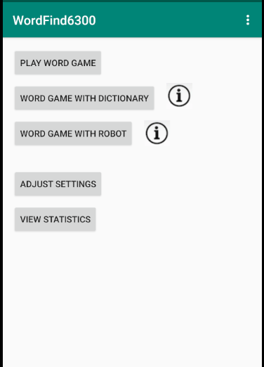
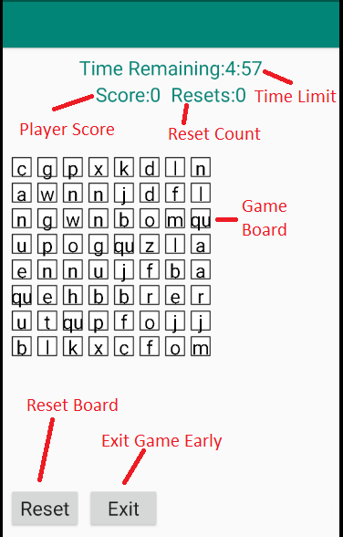
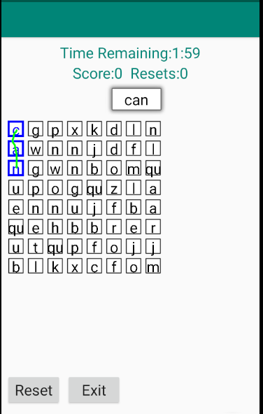
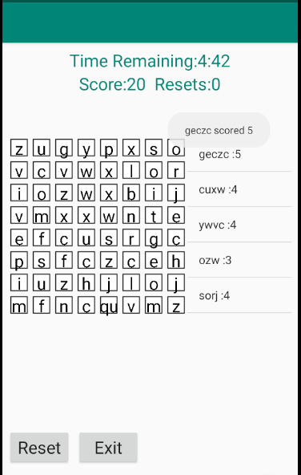
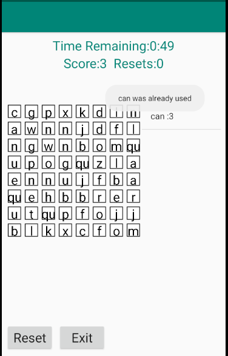
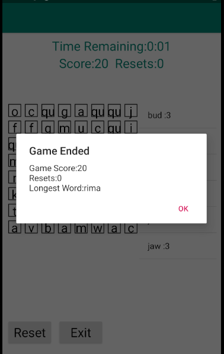
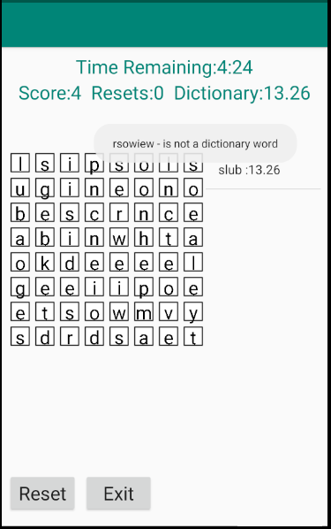
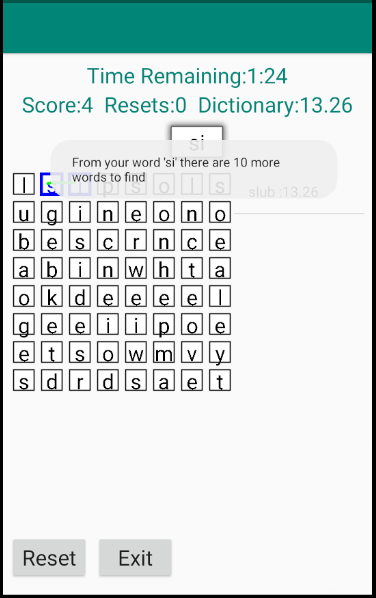
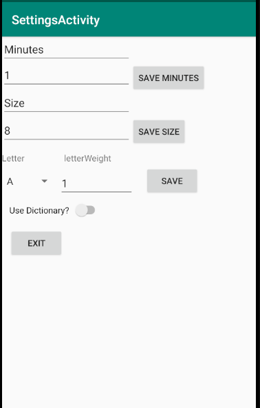

# Team 92 Boggle - User Manual

**Author**: James Damgar

**Version**: 2.0
* Changes to reflect "dictionary mode" and "robot mode".
* Changes to reflect new visual elements of the application.

**Version**: 1.0

## 1 Introduction
### 1.1 Description 
**Team 92 Boggle** is an Android application inspired by the **Boggle** word game invented by Allan Turoff and distributed by **Parker Brothers** since 1972. In this game a player attempts to identify English words within a square two dimensional board of letters before a time limit expires. The goal of the game is to score as many points as possible where each *letter* in each unique *word* played counts as 1 point, with the special *letter* "qu" counting as 2 points.

### 1.2 Game Rules
Game play begins with a square two dimensional board of letters displayed to the player. Game settings dictate the dimensions of the board ranging from 4 to 8 letters on each side (for a total of 16, 25, 36, 49, or 64 letters), the minute time limit of the game (ranging from 1-5), and individual *weights* for each English alphabet letter (ranging from 1-5). 

Rules of the game dictate that for each game board generated, a total of 1/5th (rounded up) of the letters on the board will be vowels and the remaining 4/5ths will be consonants. The letter "q" is replaced in the consonants portion of the alphabet with "qu" and represented on the board as a single *letter*. When the game generates a new board of letters on standard "Play Word Game" mode, individual letter *weights* from the game settings are factored in and letters are drawn probabilistically. I.E. If the vowel "a" has a weight of 5 and all other vowels have a weight of 1, then "a" is 5 times more likely to appear within a board cell compared to any other particular vowel. In this way certain letters can be encouraged to appear more (or less) often.

If, instead, "dictionary mode" or "robot mode" are selected ("Play Game with Dictionary" or "Word Game with Robot" UI selections), letters for the game board are drawn based on their statistical prevalence within an internal English dictionary of words.

Players may play a word so long as it meets these criteria:
* Is at least 2 letters in length ("qu" counts as 1 here).
* Each letter in a word is adjacent to the last letter in the word in one of the 8 ordinal directions (left, right, up, down, and diagonal).
* No letter in the word is played more than once for that word.
* This new word is unique (has not been played before in this game).
* If the game is played in "dictionary mode" or "robot mode", then the word must be present within the internal English dictionary of over 10,000 words.

For each successfully-played word, the player's score is incremented by 1 point for each letter, with "qu" counting as 2 points. A player may optionally **Reset** the board and generate a whole new set of letters. Each board reset incurs a penalty of **-5 points**. A player may also **Exit** a game early, prior to the expiration of the time limit.

If the game is played in "dictionary mode" or "robot mode", then a separate "dictionary score" is tallied which factors in the relative difficulty of playing a particular letter, based on statistical prevalence within words in the dictionary.

After a game ends, the game and individual word play frequencies are updated in the game's database for future viewing.

## 2 Game Application Navigation
After launching the application, players are presented with several options to proceed:
* **Play Word Game** - Start playing a new word game in "normal" (non-dictionary) mode.
* **Word Game with Dictionary** - Start playing a new word game with English dictionary checks enforced.
* **Word Game with Robot** - Start playing a new word game with English dictionary checks and an artificial robot agent playing alongside the player, entering words.
* **Adjust Settings** - Adjust the current settings applied to the next word game.
* **View Statistics** - View word and game statistics from past word games.

### 2.1 Play Word Game
After selecting to **Play Word Game** a word game, a new game is launched with the board dimension, minute time limit, and letter weight settings currently applied.

Players may select new words to play by touch-dragging to select letters that are adjacent. To begin a new word, start dragging on a starting letter. Drag to adjacent letters to include those letters in the word. When a word is complete, stop touching.

If a word is successfully played, then it is added to a list of played words seen aside the game board and the player's score is increased. Each letter in a word is worth 1 point and the special combined letter "qu" is worth 2 points. The game tracks the current time left for the game next to the score. A player may play the game until the timer runs out or may exit the game early by selecting the **Exit** button. A player may reset the board using the **Reset** button. This causes the board's letters to be regenerated. The player's score will incur a 5-point penalty for each board reset.

Each word played must be unique to be valid. An error message will be displayed if a word that has already been played is attempted.

After the game ends -- either after the expiration of the time limit or manually by the user -- the player's score and number of board resets is displayed.

### 2.2 Word Game with Dictionary
After selecting to play a **Word Game with Dictionary**, a game is started similarly to "normal mode". However, here an additional check against a dictionary of over 10,000 English words is performed for each word entered. If an attempted word is not in the dictionary, then an error message is displayed. This mode also includes a "dictionary score" field beside the reset counter. Words are scored based on the relative difficulty of each individual letter in the word, judged statistically based on words in the dictionary. 

While in this mode, if a player enters in at least two letters, a "hint" is presented to the user indicating how many words (that have not already been played) remain possible on the game board from the player's current position. This can give the player an indication on their progress towards finding all words on the game board.

Note that this mode includes an initial analysis of the game board to determine all possible playable words, prior to the user being able to play the game.

### 2.3 Play Game with Robot

After selecting to **Play Game with Robot**, the word game proceeds similarly to "dictionary mode". An additional feature of this mode is that a "robot" agent plays the game alongside the player, selecting words on the game board automatically. The player may also participate and play words so long as their actions do not interfere with the robot player.

### 2.4 Adjust Settings
After selecting to **Adjust Settings** for a word game, a player is presented with a menu to tweak these settings. A player may select a time limit, in minutes, for the game (between 1-5 minutes, inclusive), dimensions for the game board (between 4-8 letters, inclusive), and individual letter weights for each English alphabet letter ("q" => "qu"). The letter weights dictate how frequently a *letter* will be chosen to appear on a generated board in "normal mode" (when a dictionary is not used) compared to other letters of that category (vowels or consonants).

### 2.5 View Statistics
After selecting to **View Statistics** for past word games, a player is presented with two UI tab options to either view **Word Stats** or view **Game Stats**. If the player selects to view *Word Stats*, then they are presented with a list of most-frequently-used words across all past word games on this player's system, ordered by frequency.

If the player instead selects to view *Game Stats*, then they are presented with a list of past word games that have been played, ordered by final player score.

A player may select to view any one of these past word games in the list. If they do so, they can view the *final player score*, number of *board resets* performed, number of *words* played, the *dimensions* of the game board, the *minutes* time limit for the game, the *highest scoring word* for the game, and the *score* that that highest scoring word achieved.

