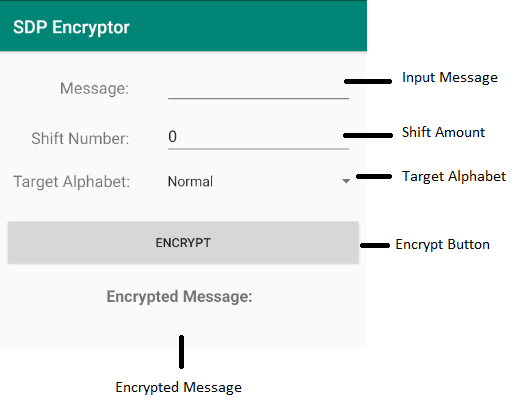
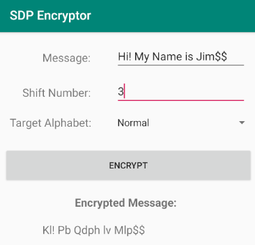

# SDP Encryptor - An Android Text Encryptor
### jdamgar3@gatech.edu | Georgia Tech OMSCS CS6300 | Spring 2020

## Description
SDP Encryptor is a simple Android OS application for encoding plaintext messages in one of three possible target alphabets:
- "Normal" - The English alphabet
- "Reverse" - The reversed English alphabet
- "QWERTY" - The English alphabet in traditional "QWERTY" keyboard order

The application works by first producing a mapping between the input English alphabet to the target alphabet specified. The message is first mapped to this target alphabet before having each character shifted by a specified amount of characters in the target sequence to produce the output, encoded message.

## Usage
The input **Message** must be a non-empty string of characters and contain at least one English language alphabetical character (a-z or A-Z). An error message is displayed if either of these is not the case. The **Shift Number** specified must be a positive integer between 1-25 inclusive and represents the number of characters to "shift" the message in the target alphabet. An error message is displayed if an invalid value is input. Finally, the **Target Alphabet** spinner allows for the selection of the target alphabet to map to. After pressing the **ENCRYPT** button, the encoded message is displayed for the user to see below.

The **case** of characters in the input message is preserved during encoding (uppercase vs. lowercase). Characters not present in the English alphabet (for example: spaces, special characters, numbers, etc.) are ignored and are preserved in the resulting encoding.

***Application layout:***



***Example usage:***



## Alphabets and Examples

The following ordering and mapping is maintained between the target alphabets:

```
Normal    A|B|C|D|E|F|G|H|I|J|K|L|M|N|O|P|Q|R|S|T|U|V|W|X|Y|Z
Reverse   Z|Y|X|W|V|U|T|S|R|Q|P|O|N|M|L|K|J|I|H|G|F|E|D|C|B|A
QWERTY    Q|W|E|R|T|Y|U|I|O|P|A|S|D|F|G|H|J|K|L|Z|X|C|V|B|N|M
```

**Example 1:** \
***Input Message:*** Cat & Dog \
***Shift Amount:*** 2 \
***Target Alphabet:*** Normal\
***Encoded Message:*** Ecv & Fqi \
(C+2, a+2, t+2, ‘ ‘, &, ‘ ‘, D+2, o+2, g+2)

**Example 1:** \
***Input Message:*** Cat & Dog \
***Shift Amount:*** 2 \
***Target Alphabet:*** Reverse\
***Encoded Message:*** Vxe & Ujr \
(C->X+2, a->z+2, t->g+2, ‘ ‘, &, ‘ ‘, D->W+2, o->l+2, g->t+2)
